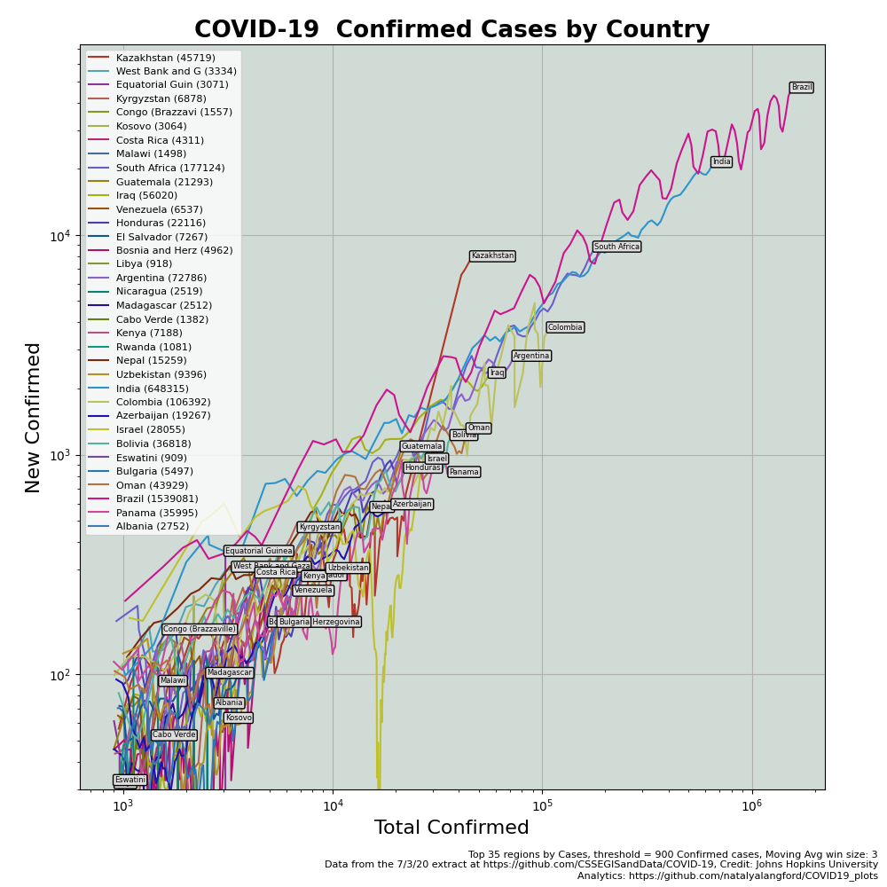
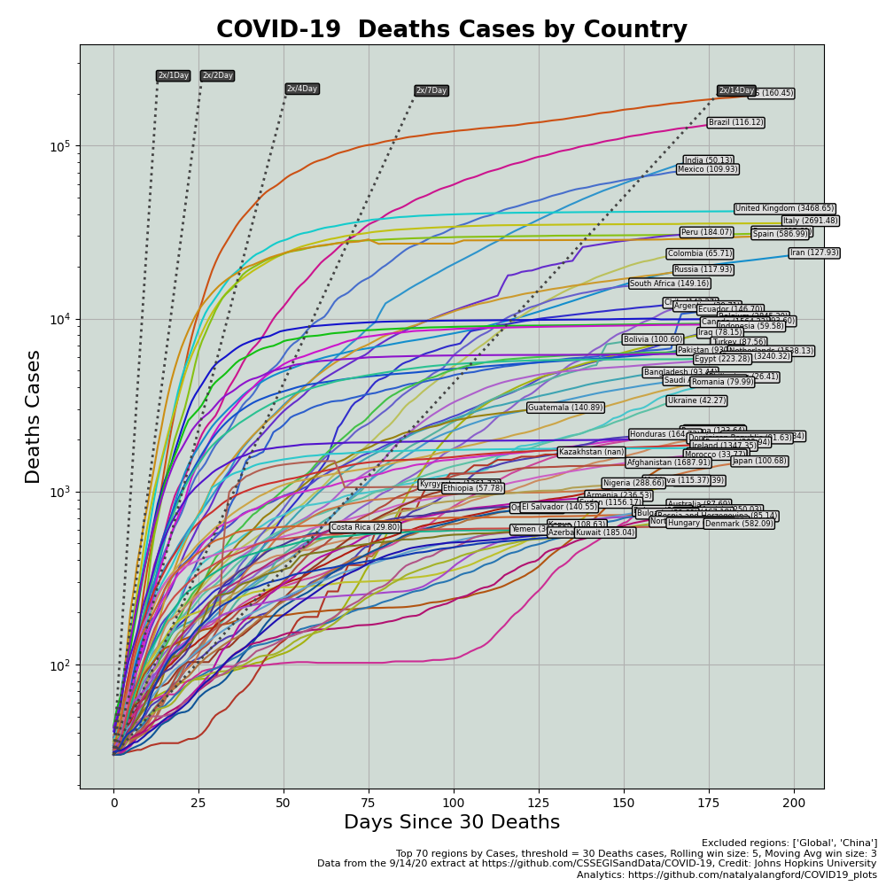
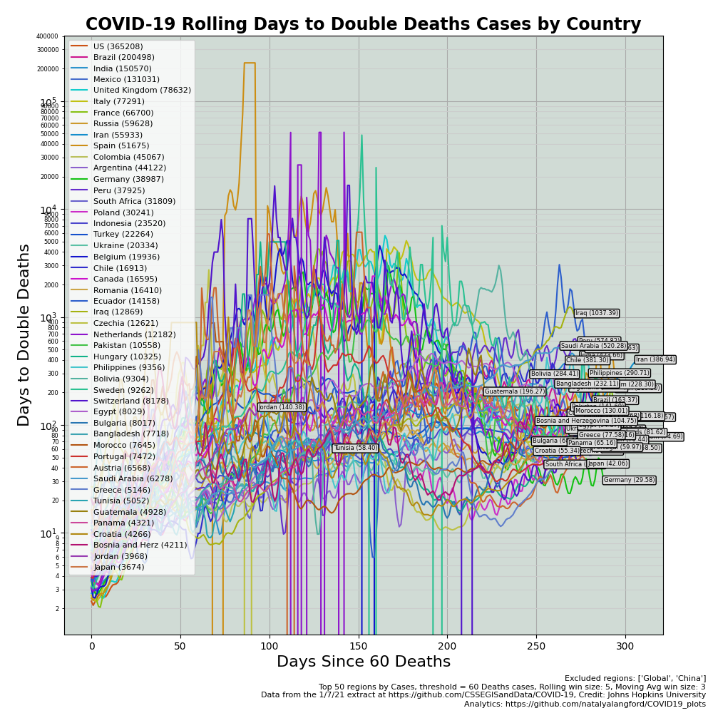
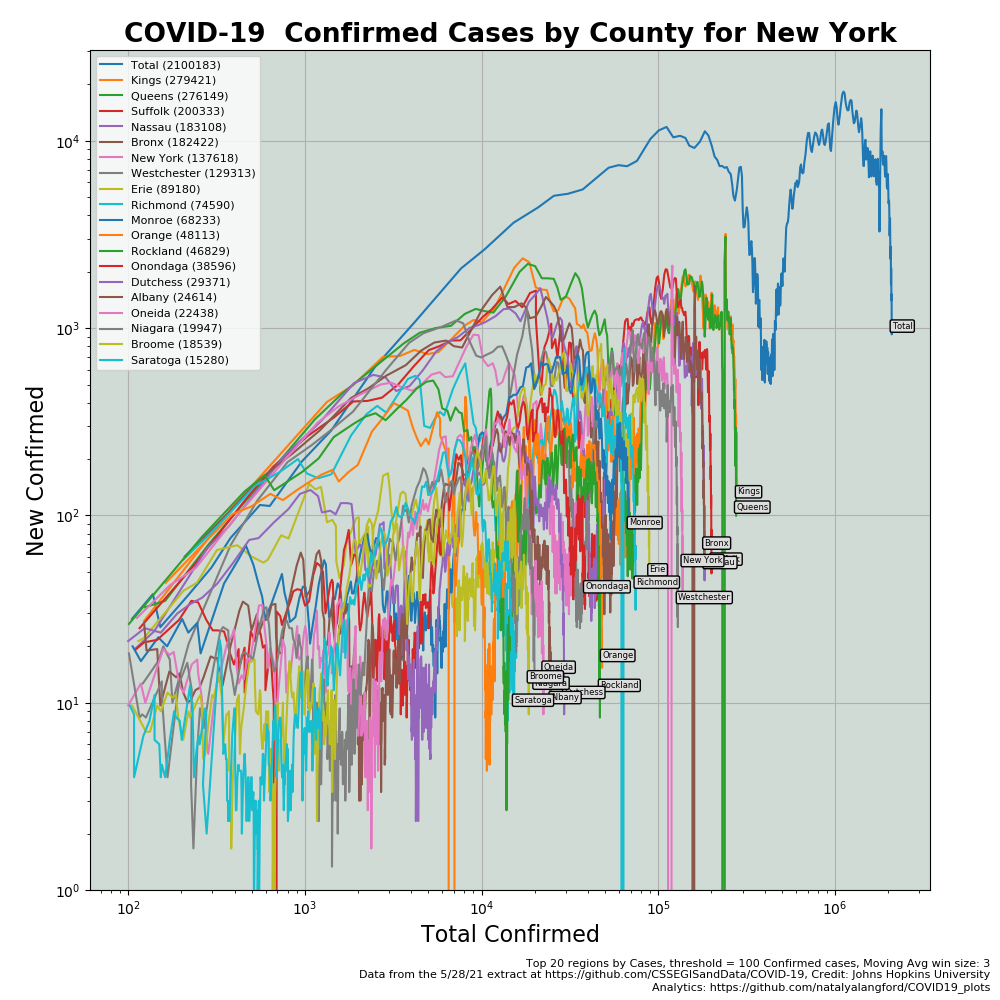
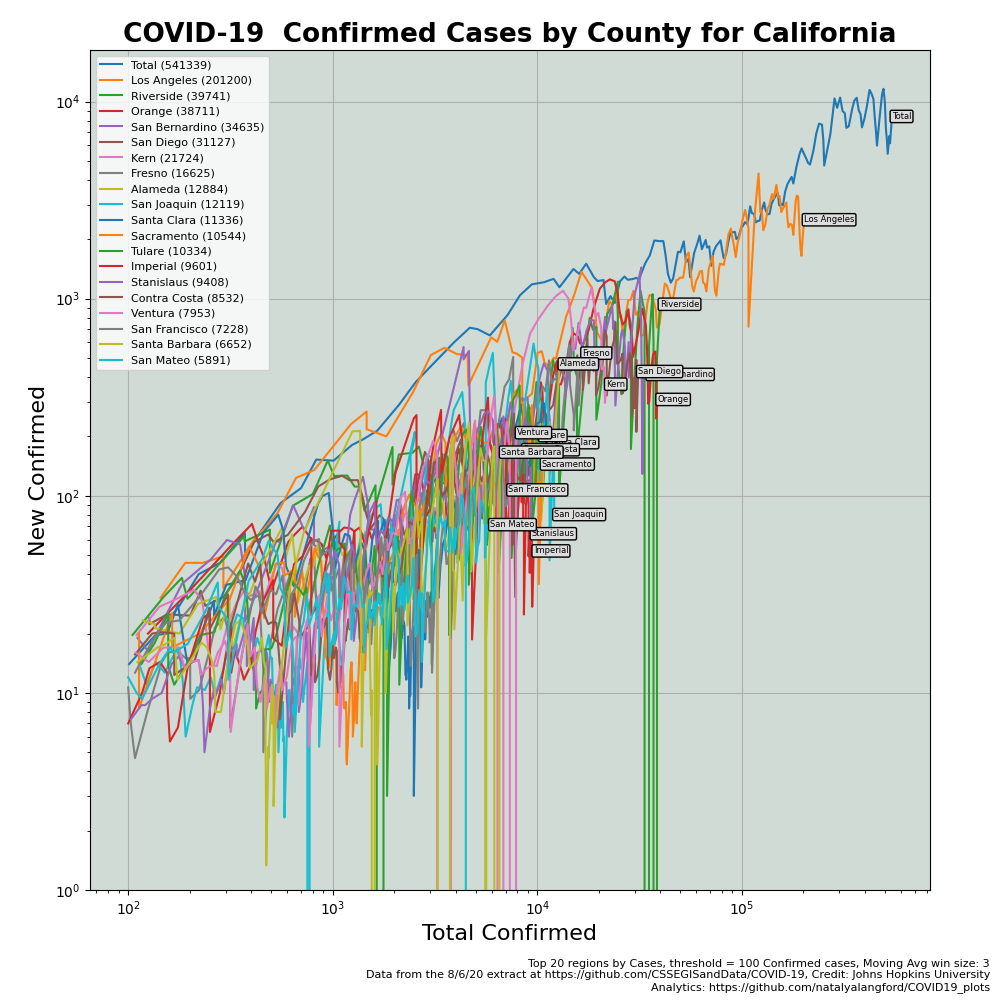
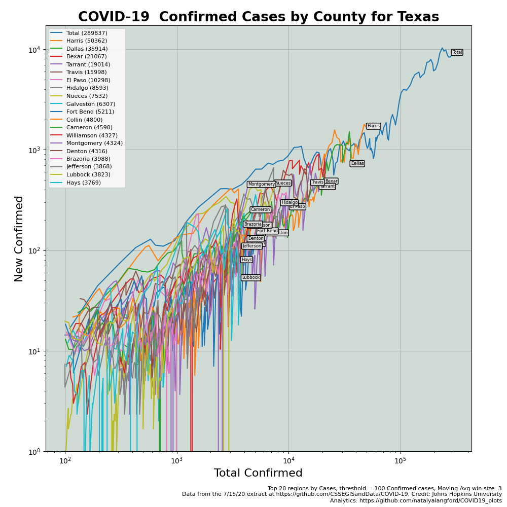
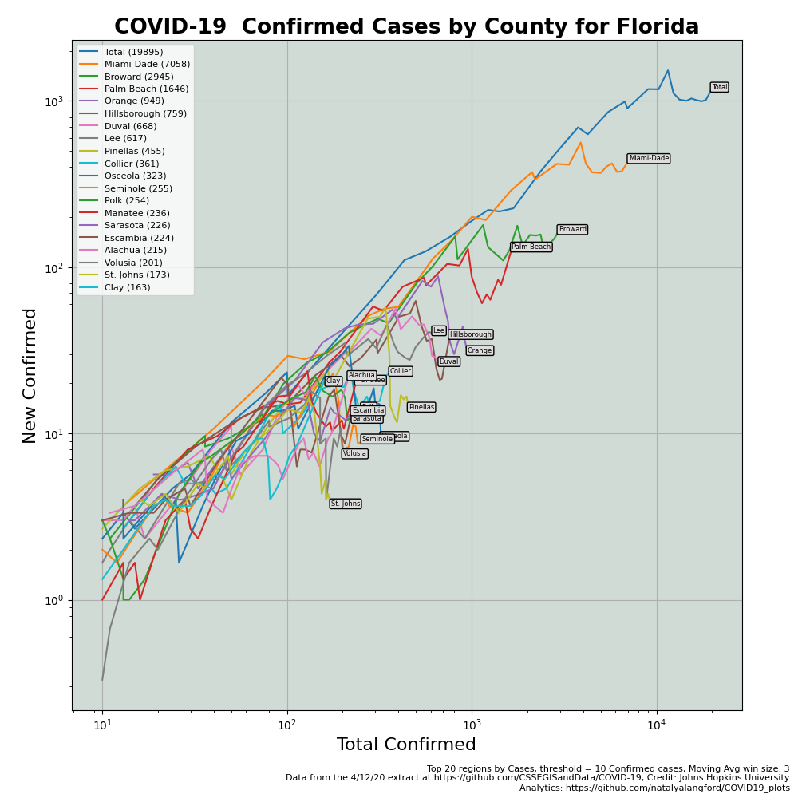
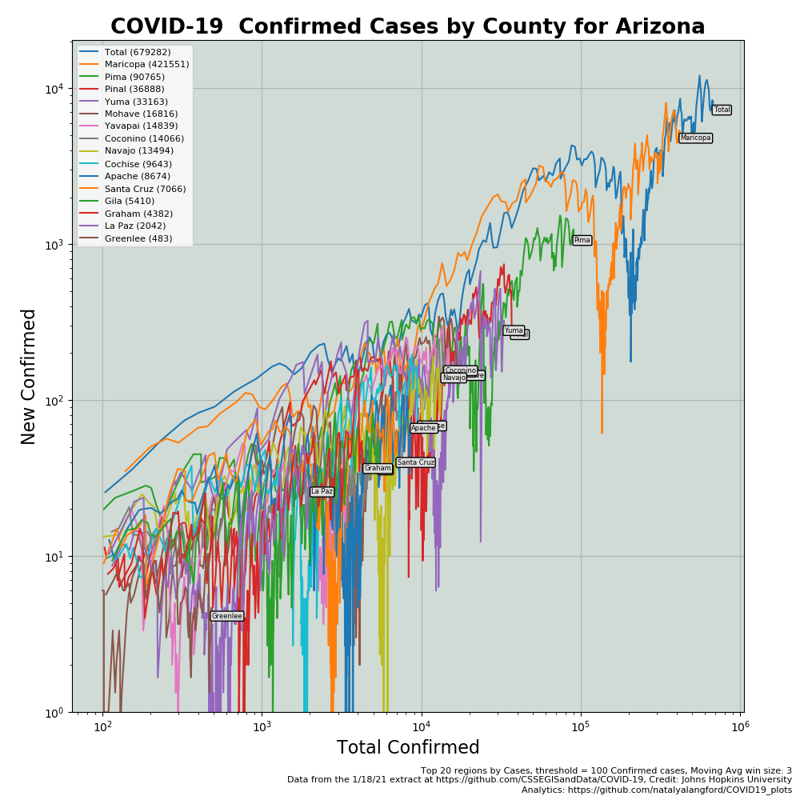
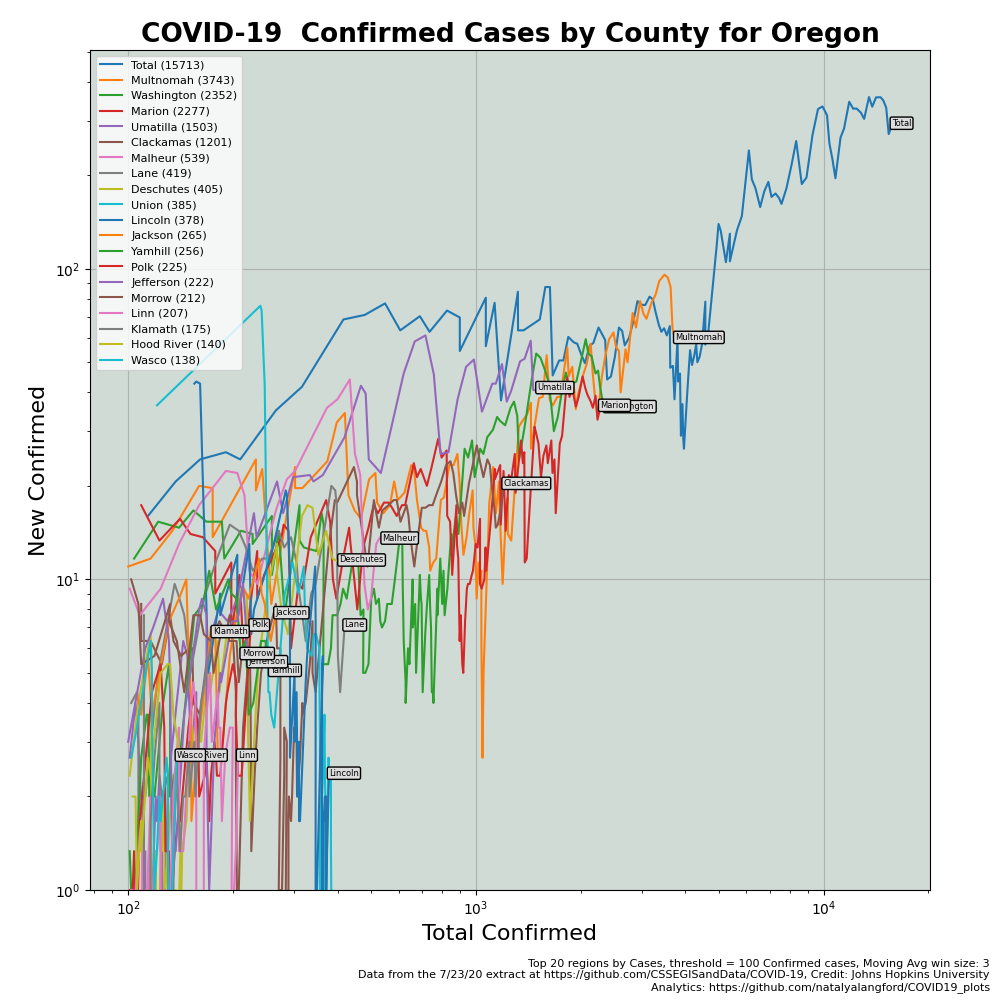
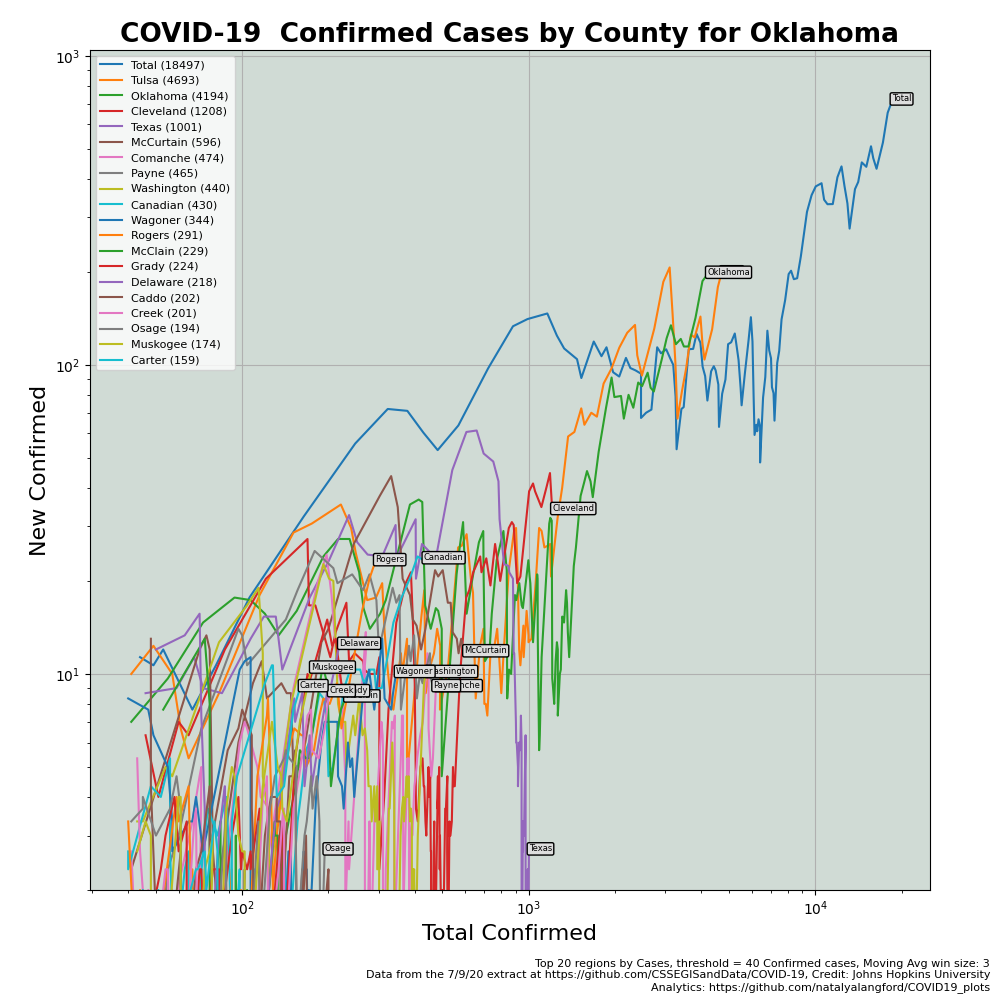

# COVID-19 Daily Reports
This daily report is based on the latest time series extracts provided by Johns Hopkins University for
global data and from USA Facts for US data.  Unfortunately, the US data lags the global data and lags 
typical reported data.  I am still looking for a more timely source.  JHU indicates they will have the
US data posted, but still not available on their GitHub site.  I assume they are working on some cool
automation to distribute accurate and timely data.  We will update our toolset when available.

## List of reports
 - [Top Country Confirmed Cases](#top-country-confirmed)
 - [Top Spreading Country Confirmed Cases](#top-spreading-country-confirmed)
 - [Top Country Deaths](#top-country-deaths)
 - [Top US States](#top-us-states)
 - [Top 20 US Counties](#top-us-counties)
 - [Selected US States](#selected-us-states)

## Top Country Confirmed
#### [Table of Confirmed Cases](confirmed_country_global_log.txt)

## Top Spreading Country Confirmed
#### [Table of Top Spreading Confirmed Cases](confirmed_country_global_w-new-total.txt)

## Top Country Deaths
#### [Table of Deaths](deaths_country_global_log.txt)

## Top US States
#### [Table of Confirmed Cases](confirmed_state_US_log.txt)
#### [Table Deaths](deaths_state_US_log.txt)

## Top US Counties
#### [Table of Confirmed Cases](confirmed_county-state_US_log.txt)
#### [Table of Deaths](deaths_county-state_US_log.txt)

## Selected US States

###### [Table for above plot](confirmed_county_NY_new-total.txt)

###### [Table for above plot](confirmed_county_CA_new-total.txt)

###### [Table for above plot](confirmed_county_TX_new-total.txt)

###### [Table for above plot](confirmed_county_FL_new-total.txt)

###### [Table for above plot](confirmed_county_AZ_new-total.txt)

###### [Table for above plot](confirmed_county_OR_new-total.txt)

###### [Table for above plot](confirmed_county_OK_new-total.txt)

## Development Team:
* [@natalyalangford](https://github.com/natalyalangford)
* [@Ricks-Lab](https://github.com/Ricks-Lab)
