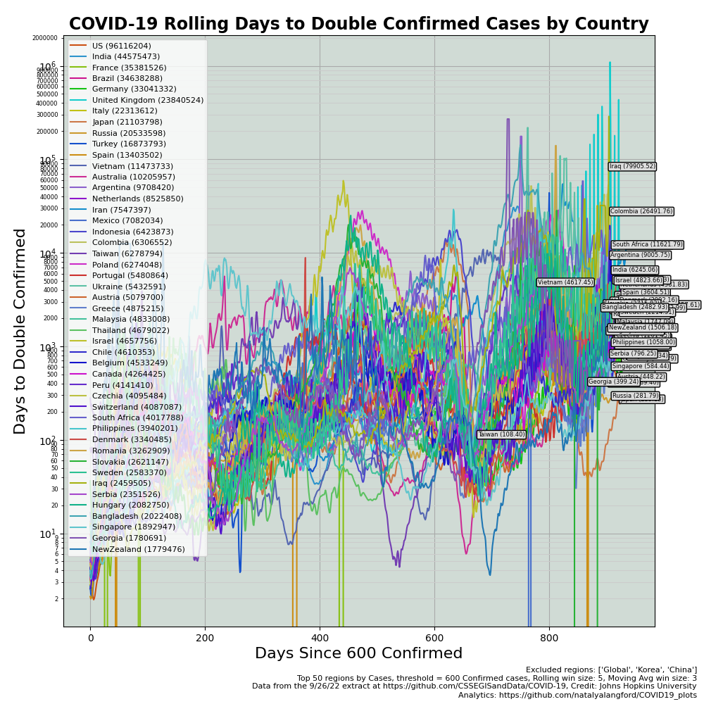
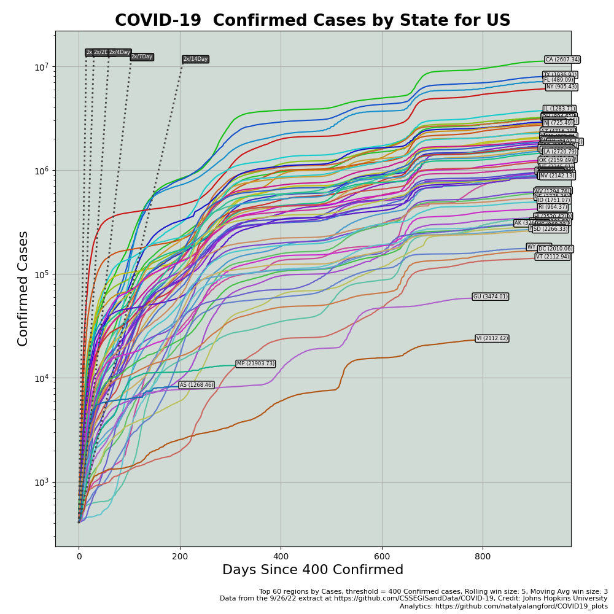
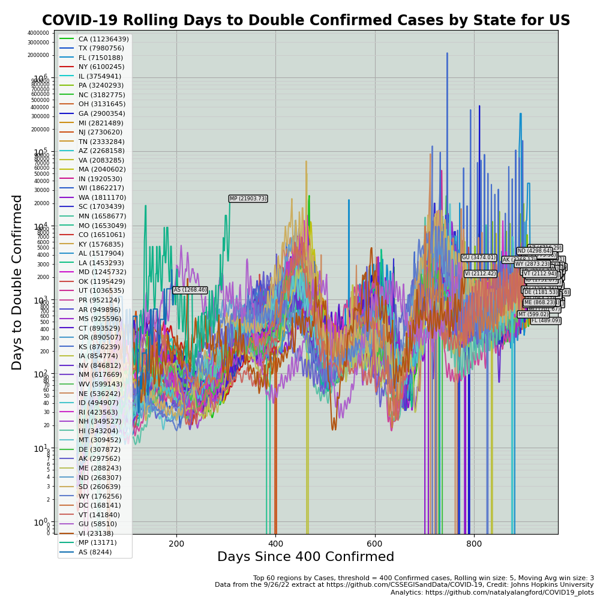
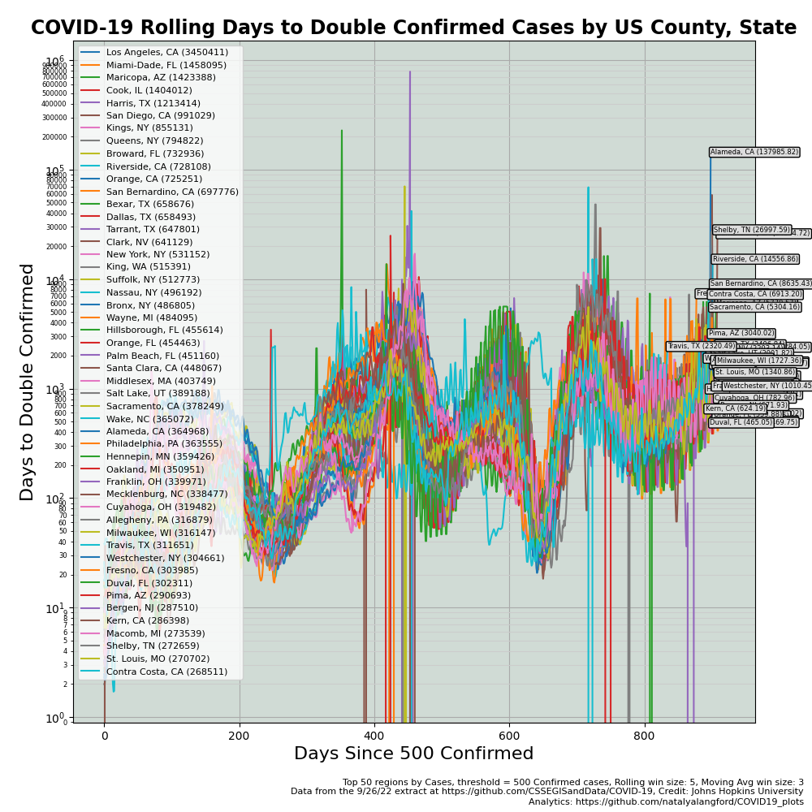
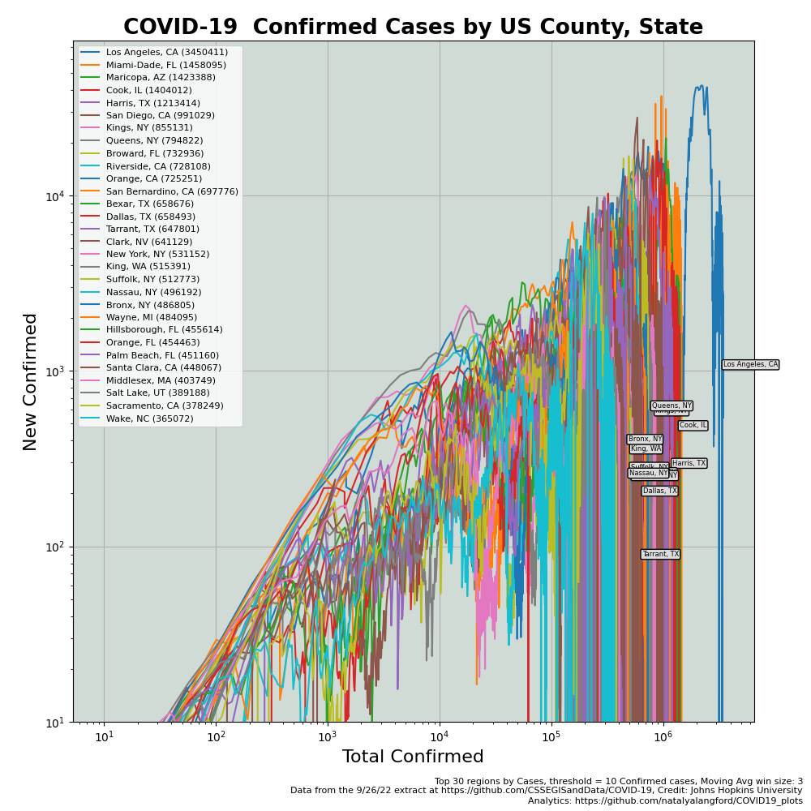

# COVID-19 Daily Reports
This daily report is based on the latest time series extracts provided by Johns Hopkins University for
global data and from USA Facts for US data.  Unfortunately, the US data lags the global data and lags 
typical reported data.  I am still looking for a more timely source.  JHU indicates they will have the
US data posted, but still not available on their GitHub site.  I assume they are working on some cool
automation to distribute accurate and timely data.  We will update our toolset when available.

## List of reports
 - [Top Countries](#top-countries)
 - [Top US Sates](#top-us-states)
 - [Top 20 US Counties](#top-us-counties)
 - [Selected US Sates](#selected-us-states)

## Top Countries

###### [Table for above plot](confirmed_country_global_log.txt)

###### [Table for above plot](deaths_country_global_log.txt)

## Top US States

###### [Table for above plot](confirmed_state_US_log.txt)

###### [Table for above plot](deaths_state_US_log.txt)

## Top US Counties

###### [Table for above plot](confirmed_county-state_US_log.txt)

###### [Table for above plot](deaths_county-state_US_log.txt)

## Selected US States

###### [Table for above plot](confirmed_county_NY_log.txt)

###### [Table for above plot](confirmed_county_FL_log.txt)

###### [Table for above plot](confirmed_county_OR_log.txt)

###### [Table for above plot](confirmed_county_CA_log.txt)

###### [Table for above plot](confirmed_county_TX_log.txt)

## Development Team:
* [@natalyalangford](https://github.com/natalyalangford)
* [@Ricks-Lab](https://github.com/Ricks-Lab)
